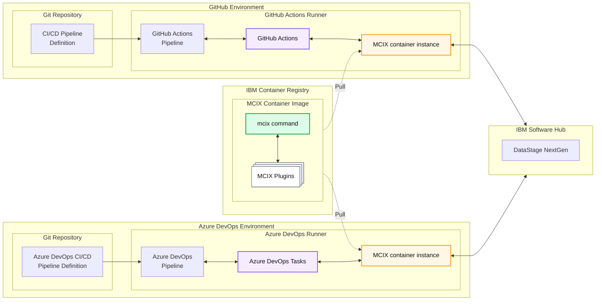

```mermaid
  flowchart LR

  %% =========================
  %% Styles
  %% =========================
  classDef registry fill:#333333,stroke:#3b82f6,stroke-width:2px,color:#111;
  classDef image fill:#eefbf3,stroke:#22c55e,stroke-width:2px,color:#111;
  classDef runtime fill:#fff7e6,stroke:#f59e0b,stroke-width:2px,color:#111;
  classDef tooling fill:#f5ecff,stroke:#8b5cf6,stroke-width:2px,color:#111;
  classDef plugin fill:#ffffff,stroke:#6b7280,stroke-width:1px,color:#111;
  classDef command fill:#dcfce7,stroke:#16a34a,stroke-width:2px,color:#111;

  %% =========================
  %% GitHub environment
  %% =========================
  subgraph GH["GitHub Environment"]
      subgraph GHREPO["Git Repository"]
        GHPIPE["CI/CD Pipeline<br/>Definition"]
      end
      subgraph GHRUN["GitHub Actions Runner"]
        GHACT["GitHub Actions<br/>Pipeline"]
        GHCONT["MCIX container instance"]
        GHA["GitHub Actions"]
      end
  end
  class GHA tooling
  class GHCONT runtime

  %% GH Tooling references 
  GHPIPE --> GHACT
  GHACT <--> GHA
  GHA <--> GHCONT

  %% =========================
  %% Registry
  %% =========================
  subgraph REG["IBM Container Registry"]
      direction TB

      %% Image internals
      subgraph IMG["MCIX Container Image"]
          MCIX["mcix command"]
          PLUGINS@{ shape: procs, label: "MCIX Plugins"}
          %% GOV["Container Governance Artefacts"]
      end
      class MCIX command
      class PLUGINS plugin
      class IMG image

  end
  %% class REG registry

  MCIX <--> PLUGINS

  subgraph CPD["IBM Software Hub"]
    DATASTAGE["DataStage NextGen"]
  end

  %% =========================
  %% Azure DevOps environment
  %% =========================
  subgraph ADO["Azure DevOps Environment"]
      subgraph ADOREPO["Git Repository"]
        ADOPIPEDEF["Azure DevOps CI/CD<br/>Pipeline Definition"]
      end
      subgraph ADORUN["Azure DevOps Runner"]
        ADOPIPERUN["Azure DevOps<br/>Pipeline"]
        ADOT["Azure DevOps Tasks"]
        ADOCONT["MCIX container instance"]
      end
  end
  class ADOT tooling
  class ADOCONT runtime

  %% =========================
  %% Distribution from registry
  %% =========================
  IMG -. Pull .-> GHCONT
  IMG -. Pull .-> ADOCONT

  %% ADO Tooling references 
  ADOPIPEDEF --> ADOPIPERUN
  ADOPIPERUN <--> ADOT
  ADOT <--> ADOCONT

  %% Action/Task links to CPD
  GHCONT <--> CPD
  ADOCONT <--> CPD

```
