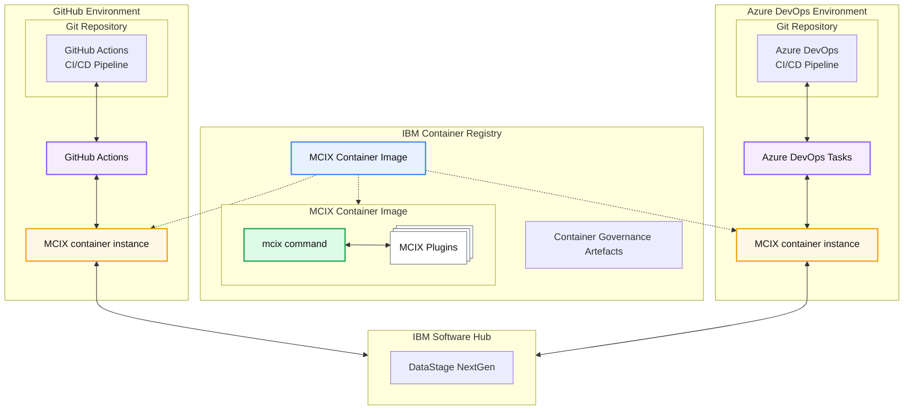

```mermaid
  flowchart TD

  %% =========================
  %% Styles
  %% =========================
  classDef registry fill:#e8f1ff,stroke:#3b82f6,stroke-width:2px,color:#111;
  classDef image fill:#eefbf3,stroke:#22c55e,stroke-width:2px,color:#111;
  classDef runtime fill:#fff7e6,stroke:#f59e0b,stroke-width:2px,color:#111;
  classDef tooling fill:#f5ecff,stroke:#8b5cf6,stroke-width:2px,color:#111;
  classDef plugin fill:#ffffff,stroke:#6b7280,stroke-width:1px,color:#111;
  classDef command fill:#dcfce7,stroke:#16a34a,stroke-width:2px,color:#111;

  %% =========================
  %% GitHub environment
  %% =========================
  subgraph GH["GitHub Environment"]
      subgraph GHREPO["Git Repository"]
        GHPIPE["GitHub Actions<br/>CI/CD Pipeline"]
      end
      GHCONT["MCIX container instance"]
      GHA["GitHub Actions"]
  end
  class GHA tooling
  class GHCONT runtime

  click GHA href "https://www.github.com](https://github.com/marketplace?query=mcix)" "GitHub Marketplace" _blank

  %% GH Tooling references 
  GHPIPE <--> GHA
  GHA <--> GHCONT

  %% =========================
  %% Registry
  %% =========================
  subgraph REG["IBM Container Registry"]
      direction TB
      ICR["MCIX Container Image"]
      GOV["Container Governance Artefacts"]

      %% Image internals
      subgraph IMG["MCIX Container Image"]
          MCIX["mcix command"]
          PLUGINS@{ shape: procs, label: "MCIX Plugins"}
      end
      class MCIX command
      class PLUGINS plugin
      class IMG image

  end
  class ICR registry

  ICR -.-> IMG
  MCIX <--> PLUGINS

  subgraph CPD["IBM Software Hub"]
    DATASTAGE["DataStage NextGen"]
  end

  %% =========================
  %% Azure DevOps environment
  %% =========================
  subgraph ADO["Azure DevOps Environment"]
      subgraph ADOREPO["Git Repository"]
        ADOPIPE["Azure DevOps<br/>CI/CD Pipeline"]
      end
      ADOT["Azure DevOps Tasks"]
      ADOCONT["MCIX container instance"]
  end
  class ADOT tooling
  class ADOCONT runtime

  %% =========================
  %% Distribution from registry
  %% =========================
  ICR -.-> GHCONT
  ICR -.-> ADOCONT

  %% ADO Tooling references 
  ADOPIPE <--> ADOT
  ADOT <--> ADOCONT

  %% Action/Task links to CPD
  GHCONT <--> CPD
  ADOCONT <--> CPD

```
