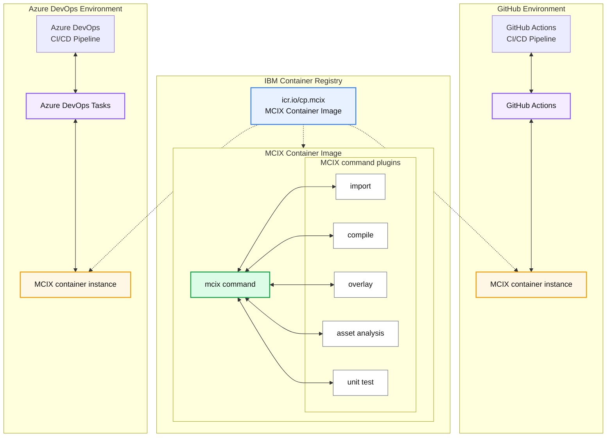

```mermaid
  flowchart TD

  %% =========================
  %% Styles
  %% =========================
  classDef registry fill:#e8f1ff,stroke:#3b82f6,stroke-width:2px,color:#111;
  classDef image fill:#eefbf3,stroke:#22c55e,stroke-width:2px,color:#111;
  classDef runtime fill:#fff7e6,stroke:#f59e0b,stroke-width:2px,color:#111;
  classDef tooling fill:#f5ecff,stroke:#8b5cf6,stroke-width:2px,color:#111;
  classDef plugin fill:#ffffff,stroke:#6b7280,stroke-width:1px,color:#111;
  classDef command fill:#dcfce7,stroke:#16a34a,stroke-width:2px,color:#111;

  %% =========================
  %% GitHub environment
  %% =========================
  subgraph GH["GitHub Environment"]
      GHCONT["MCIX container instance"]
      GHA["GitHub Actions"]
      GHPIPE["GitHub Actions<br/>CI/CD Pipeline"]
  end
  class GHA tooling
  class GHCONT runtime

  %% GH Tooling references 
  GHPIPE <--> GHA
  GHA <--> GHCONT

  %% =========================
  %% Registry
  %% =========================
  subgraph REG["IBM Container Registry"]
      ICR["icr.io/cp.mcix<br/>MCIX Container Image"]

      %% Image internals
      subgraph IMG["MCIX Container Image"]
          MCIX["mcix command"]

          subgraph PLUGINS["MCIX command plugins"]
              P1["import"]
              P2["compile"]
              P3["overlay"]
              P4["asset analysis"]
              P5["unit test"]
          end
      end
      class MCIX command
      class P1,P2,P3,P4,P5 plugin
      class IMG image

  end
  class ICR registry

  ICR -.-> IMG
  MCIX <--> P1
  MCIX <--> P2
  MCIX <--> P3
  MCIX <--> P4
  MCIX <--> P5

  %% =========================
  %% Azure DevOps environment
  %% =========================
  subgraph ADO["Azure DevOps Environment"]
      ADOT["Azure DevOps Tasks"]
      ADOPIPE["Azure DevOps<br/>CI/CD Pipeline"]
      ADOCONT["MCIX container instance"]
  end
  class ADOT tooling
  class ADOCONT runtime

  %% =========================
  %% Distribution from registry
  %% =========================
  ICR -.-> GHCONT
  ICR -.-> ADOCONT

  %% ADO Tooling references 
  ADOPIPE <--> ADOT
  ADOT <--> ADOCONT

```
